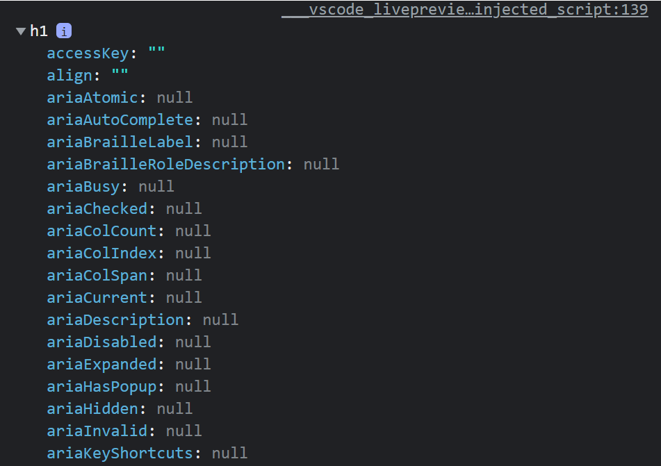

# DOM (Document Object Model)

DOM is a programming interface for web documents, and it represents the page so that programs can change the document structure, style and content.

A webpage is a document, and it can either displayed in the browser or as an HTML source. In both cases it is the same document and the DOM representation allows to manipulate it, using an object oriented approach. 

The DOM is the fundamental principle of knowing how to manipulate HTML files from a JS script. JavaScript uses it to access the document and all of its elements. 

Consider our project that we had before

```
project/
    index.html
    style.css
    script.js
```

In the `script.js` file we can start by using `document` from the DOM API. If we want to grab any tag in our `index.html` qe can use the `document.querySelector()` function

**`index.html`**
```
<!DOCTYPE html>
<html lang="en">
<head>
    <meta charset="UTF-8">
    <meta http-equiv="X-UA-Compatible" content="IE=edge">
    <meta name="viewport" content="width=device-width, initial-scale=1.0">
    <link rel="stylesheet" href="./style.css">
    
    <title>Document</title>
</head>
<body>

    <h1>DOM manipulation</h1>
    
    <p>
        Lorem, ipsum dolor sit amet consectetur adipisicing elit. Quasi, cumque?
    </p>

    <p class="twenty-lines">
        Lorem ipsum dolor sit amet consectetur adipisicing elit. Aut impedit dolores quae id pariatur placeat, iure libero maiores omnis laudantium?
    </p>
    
    <p id="thirty-lines">
        Lorem ipsum dolor sit amet consectetur adipisicing elit. Autem sit porro veniam aliquam aliquid architecto iure corrupti magnam nesciunt, dolorum tempora repellat consequuntur illo atque optio laudantium est eius qui!
    </p>

    <input type="text" placeholder="Type here">
    
    <script src="./script.js"></script>
</body>
</html>
```

**`script.js`**
```
const h1 = document.querySelector('h1')
const thirty = document.querySelector('#thirty-lines');
const twenty = document.querySelector('.twenty-lines');
const p = document.querySelector('p')

console.log({
    h1,
    p,
    twenty,
    thirty,
    input

});

```

Notice that using `querySelector()` we can grab any element in the `index.html` . It works very much the same as in CSS, if we want to grab an id we use `#`, and for classes we use `.` dot notation. There are many other ways to select HTML items, such as `getElementById()` or `getElementByClass(0)` and many others, but `querySelector()` allows to grab any tag, class or id so it is quite sufficient most of the time. 

We can check what we have so far in the console of the inspection tools in the browser. 

<center>


</center>

Notice that since we console logged an object, we will be able to see the output as one, with all of the attributes and information of each of the elements. 

## Modyfing HTML using JavaScript
We can do this using some DOM methods as well. One of them is `.innerHTML`, which allows to type HTML code inside a string expression

**`script.js`**

```
h1.innerHTML = "Some other text <br> More text";
```

Notice what we are doing in this line. We are writing code inside a string. This is a very bad practice and it is not recommended at all, due to security purposes. Typing a string expression is not something that requires any computational effort and accesibility, so any users could easily do it, and if we are executing code from within then the HTML document could change drastically. 

This is why there is another method to prevent that: `.innerText`.


We could also get the class or id of an HTML element by using `getAttribute("class")` or `getAttribute("id")` or any other labeled tag in our document. 

```
console.log(thirty.getAttribute("id"))

```

With `setAttribute("attribute-name","new-name")` we can change the class, id, or any other labeled tag.

- `.innerHTML`
- `.innerText`
- `.getAttribute("attribute-name")`
- `.setAttribute("attribute-name","new-name")`
- `.classList.add("new-class")`
- `.classList.remove("existing-class")`

Okay but all of this attributes seem like they came out of nowhere. How do we know exactly what are we trying to modify for each tag? The answer is pretty simple, and this is why selecting the tags is very important.

Recall that the very first thing we did was to use `.querySelector()` to grab HTML tags as variables in our JavaScript. Every time we do that, we are also grabbing all of the *attributes of that specific tag*, and we can check them out in the browser console. 

If we do `console.log(h1)`, the output in the browser would look something like this: 

<center>



</center>


Now everything makes more sense. These are all the attributes that we are accessing in all of those shown before. Just like any other object, using dot notation `.` we can access to a specific key and change its value. 

Every tag that we grab as a variable in the `script.js` is an object itself, with tenths of keys and their corresponding values. 
